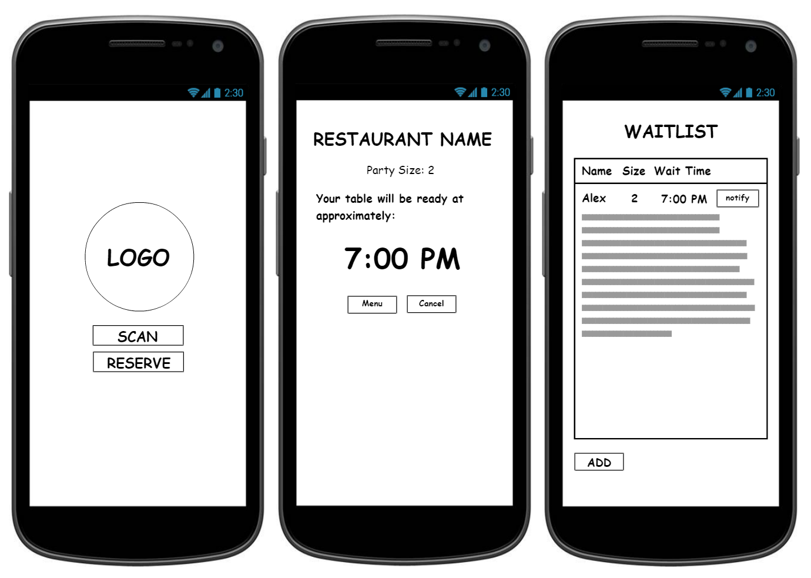

# QueueR

This application is a queueing/waitlist + reservation + ordering system for restaurants. During busy hours, such as lunch or dinner time, it gets hectic in restaurants. People may be waiting in the restaurant while not being approached by the host for a while. A solution to this is to allow the  customers to do this themselves. Customers could scan a QR code and list the number of people in their party to automatically add themselves on the waitlist. While they are waiting, they could also look at the menu and order their food. When they have time, the restaurant could use their interface to notify their customers about the wait time. 

<b>Basic View of the App</b> 
