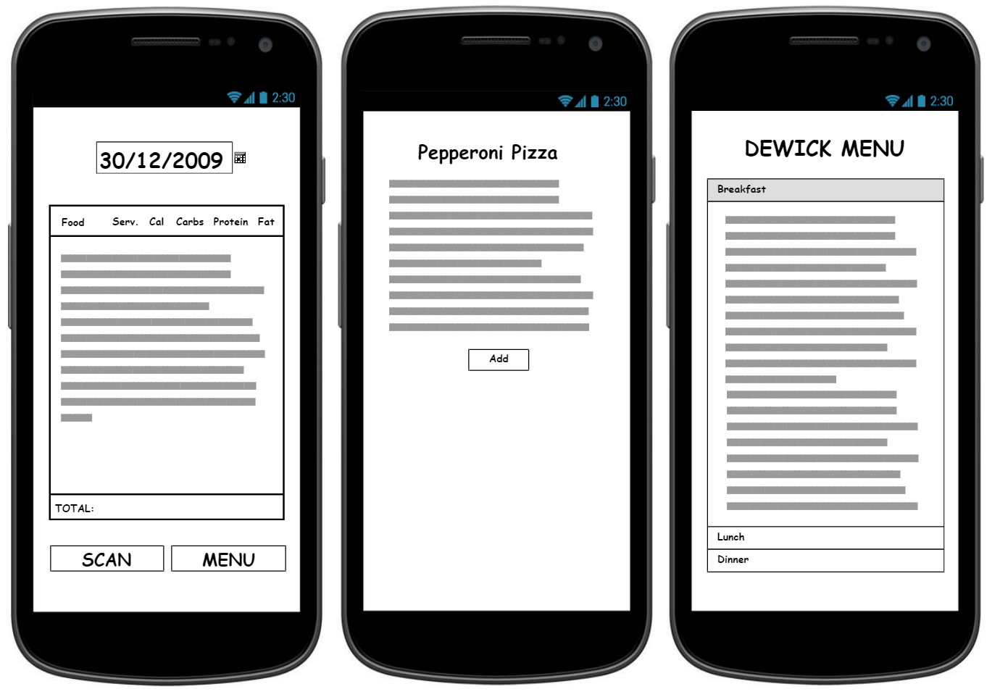
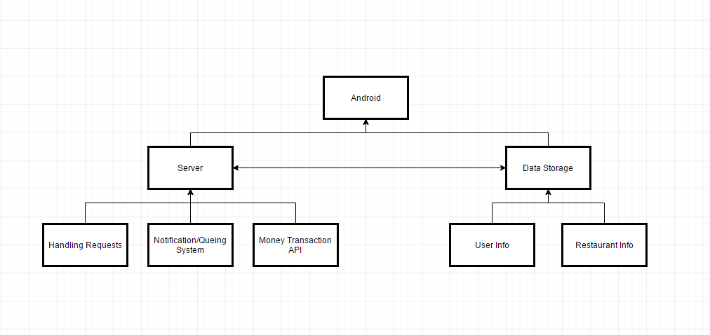

# QueueR

# Week 2, Sept 29th

This week we started to build the app. We chose the 1st app idea because for the 2nd app it's hard to associate each everyone of the dishes with a unique QR code, and there aren't many opportunities to expand on new ideas. For our app build, right now it has a listview that holds customer information (name, party size and wait time), and 3 textviews that are the titles of the list. There is an "add entry" button at the buttom of the screen that when clicked on will show a pop up window where you can enter information for a new customer and add it to the listview. Next we plan to make the list editable by tapping on list items, and set up a database that holds the entry information. 

# Week 1

<b>Description</b>  
There are two applications that we are currently considering: (1) a queueing system for restaurants and  (2) a calorie counter for the dining halls. 

(1) This application is a queueing/waitlist + reservation + ordering system for restaurants. During busy hours, such as lunch or dinner time, it gets hectic in restaurants. People may be waiting in the restaurant while not being approached by the host for a while. A solution to this is to allow the  customers to do this themselves. Customers could scan a QR code and list the number of people in their party to automatically add themselves on the waitlist. While they are waiting, they could also look at the menu and order their food. When they have time, the restaurant could use their interface to notify their customers about the wait time. 

(2) This application is a calorie counter for Tufts dining halls. When going to the dining halls, it is difficult to track the calories and nutrients of each food, especially during peak hours when you feel rushed to get your food to get the line moving. This app tries to solve this problem by using the camera to quickly scan QR code on the labels of each respective food to obtain and quickly tabulate the calories and nutrients of your meal. 

<b>Who would use our apps?</b> 
(1) The stakeholders are the restaurant owners, and the customers are the restaurant customers. 

(2) The customers of this app are primarily Tufts students and faculties. The stakeholders are Tufts dining halls and cafe. 

<b>Basic View of the App</b> 
(1) 

(2) 

<b>Architecture of our app</b> 

<b>Core functionalities of our app</b> 
(1) The core functionalities are scanning QR codes, reservation and queue databases. 

(2) Scanning QR codes, calculate calories. 

<b>Secondary functionalities</b> 
(1) Money transaction API, so people can order and pay for their food while waiting, and the chefs can get a headstart.

(2) Recommend food based on user profile and goals. 

<b>Mobile device features that we might use</b> 
(1) This app will use the camera in order to scan QR codes. It may also use SMS to notify the user about wait times or when their table is ready 

(2) This app will primarily use just the camera. 

<b>Possible Limitations?</b> 
(1) One limitation is the money transaction aspect of the app. We do not have any restaurants cooperating with us, and it would be difficult to test ordering food. 

(2) We have to let Tufts Dining give us their database and convert it to fit our system. As an alternative, we plan to scrape the menu online in order to get the data. Also, the food recommendation algorithm could be complicated. 

<b>How we plan to advertise the app.</b> 
(1) We could manually notify restaurant owners and try to convince them to try the app. We could also try to find a popular newsletter for restaurant owners or food lovers and try to advertise it there. 

(2) This app would be advertised through the dining halls, flyers throughout campus, or school newsletters. 